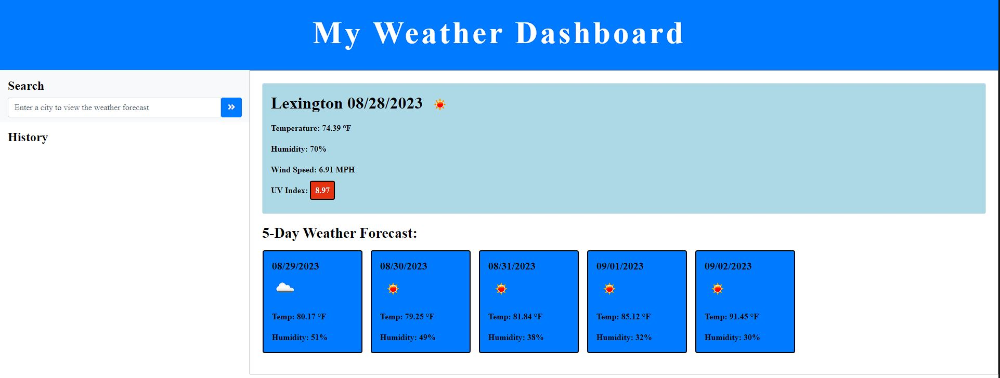
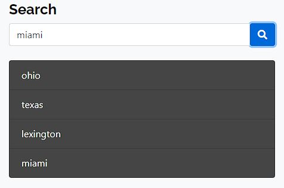

# My Weather Application
 
A simple application for looking up local weather forecasts of a chosen area. 

### URL : 

Github: https://github.com/Anthonykahly/my-weather-app
Pages: https://anthonykahly.github.io/my-weather-app/

## Description

```

This simple weather app allows for travelers to look at the weather ahead of time with any given location. The application will give the user information such as the wind, temperature, and even uses a color coded system for the UV index so that the user can plan for their trip.

```

## User Story

```

AS A traveler
I WANT to see the weather outlook for multiple cities
SO THAT I can plan a trip accordingly

```

## Acceptance Criteria

```

GIVEN a weather dashboard with form inputs
WHEN I search for a city
THEN I am presented with current and future conditions for that city and that city is added to the search history
WHEN I view current weather conditions for that city
THEN I am presented with the city name, the date, an icon representation of weather conditions, the temperature, the humidity, and the wind speed
WHEN I view future weather conditions for that city
THEN I am presented with a 5-day forecast that displays the date, an icon representation of weather conditions, the temperature, the wind speed, and the humidity
WHEN I click on a city in the search history
THEN I am again presented with current and future conditions for that city

```

## Usage

```
- Upon opening the page users will be prompted to enter a city into a search bar
- The site will then link to local weather and display information including the temperature, wind, and heat index for the area.
- Recent searches will show on the left side of the screen for quick reference 
```
 
